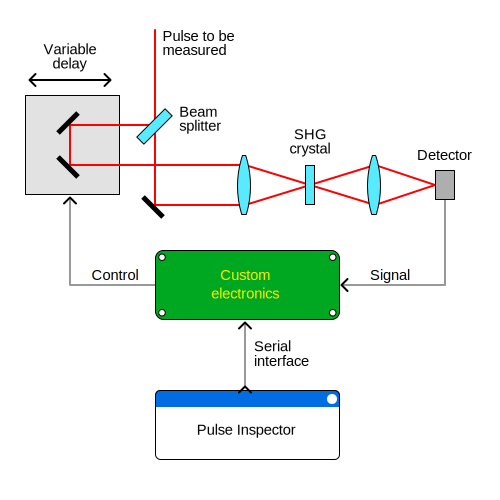
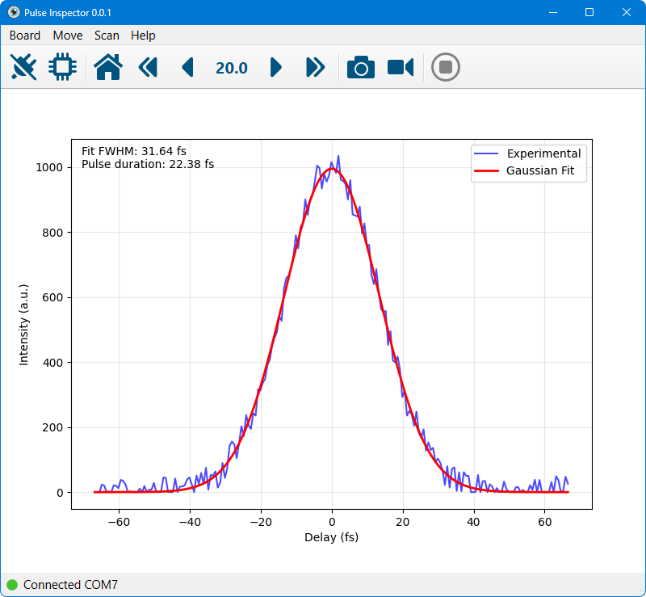

# Pulse Inspector

Pulse Inspector is a desktop application designed to control hardware and visualize measurement results for autocorrelation experiments. It's built with Python, as it provides advanced math and plotting, and Qt for its the best UI framework in the world.

The only autocorrelator-specific logic implemented in the application is the graph fitting and pulse width estimation. The heavy lifting of actual measurement acquisition and processing is delegated to the electronics firmware. The software does not make assumptions about the specific measurement electronics being used. Instead, it communicates with any compatible device through a serial interface protocol. See [board_config.ini](./board_config.ini), whish is a self-documented protocol configuration.

The actual custom electronics implementation is outside the scope of this repository. This repository includes [example Arduino sketches](./arduino/emulator_dummy/README.md) that should demonstrate how to process and respond to protocol commands and provide a starting point for custom firmware development. These examples focus on protocol handling rather than advanced measurement logic.





## Development

Prepare environment

```bash
# Clone the repository
git clone https://github.com/orion-project/pulse-inspector
cd pulse-inspector

# Create virtual environment (recommended)
python -m venv .venv
.venv\Scripts\activate

# Install dependencies
pip install -r requirements.txt
```

Run from sources

```bash
python main.py
```

Use the [virtual_board.py](./virtual_board.py) module to develop and test the interaction between the UI and the communication protocol. It works as a virtual hardware, allowing for testing UI functionality without having a physical device. The module is activated when running as:

```bash
python main.py --virtual
```

Use the [serial_board.py](./serial_board.py) module in conjunction with the [emulator_dummy.ino](./arduino/emulator_dummy/README.md) sketch to validate the serial communication and develop and test the interaction between the protocol and actual hardware.

## Supporters

Thanks to our friends who made this possible and available for everyone:

<a href="https://www.n2-photonics.de"></a>
