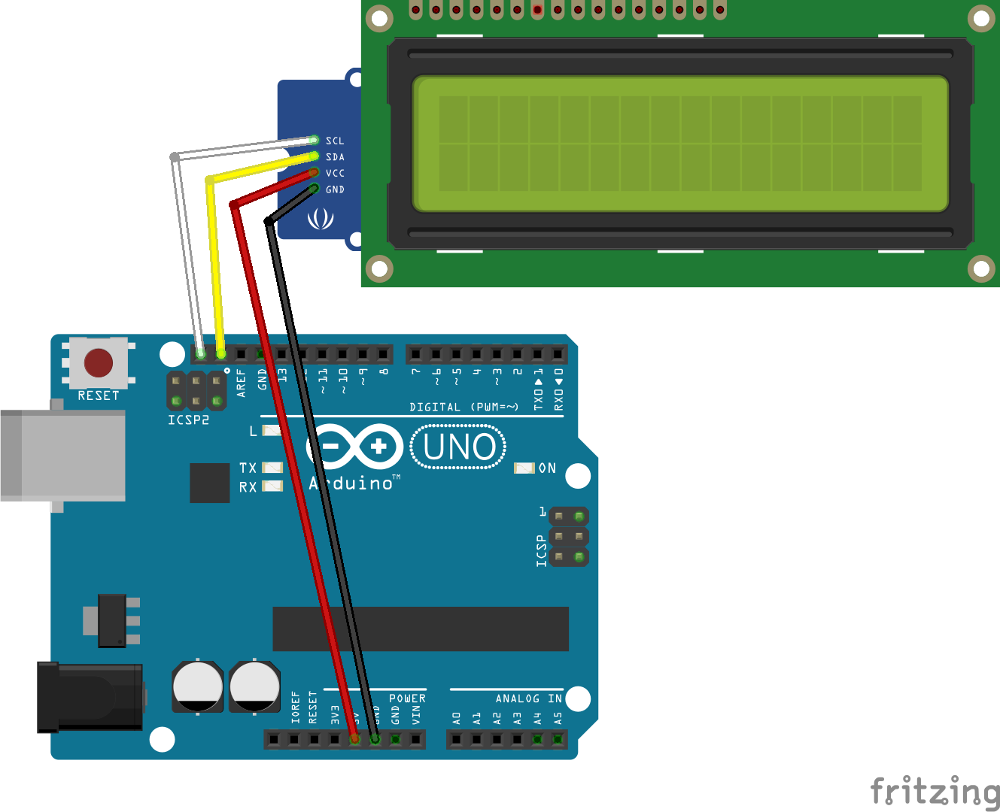

# Emulator Dummy

This is a test sketch that allows testing the interaction of the UI with boards in the absence of real hardware parts. Only an Arduino board is needed - the sketch emulates the behavior of hardware components that would normally be connected to it.

The sketch emulates stage movement by predefined delays. Autocorrelation scan is emulated by small delays between measurement points. A random signal magnitude is generated for each point. All points together form a sample Gaussian profile. The profile center is in the middle of the predefined scan range.

This approach is somewhat analogous to what the `virtual_board.py` module does, except that `virtual_board.py` simulates the entire board in software (no hardware required at all), while this sketch runs on real hardware (an Arduino board) but simulates the connected hardware parts.

An LCD screen with I2C can be used to show currently running operations on the board. But the sketch is fully functional without it; just comment the `USE_LCD` definition.

